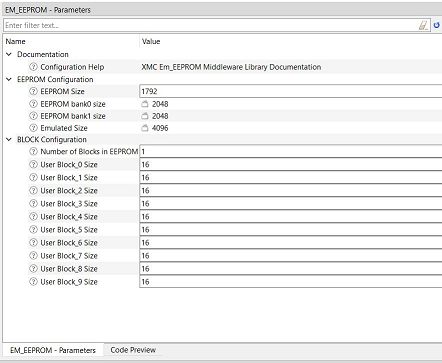
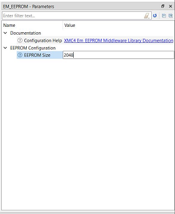

# XMC 1000 and 4000 Emulated EEPROM Middleware Library

### Overview
The Emulated EEPROM middleware emulates an EEPROM device in the XMC1000 or XMC4000 device flash memory. The EEPROM middleware operates on the top of the Flash driver included in the XMCLib Library (mtb-xmclib-cat3).

Use the Emulated EEPROM to store nonvolatile data on a target device. The Emulated EEPROM asset uses the Flash resource to store data. The EEPROM asset is design to allow higher erase/write capabilities compared to the underlying flash capability.

The XMC1xxx Middleware asset automatically maps the EEPROM to required size at the end of Flash. The user can provide the size of user EEPROM required in EEPROM personality or through Makefile file define: E_EEPROM_XMC1_FLASH_EEPROM_SIZE=<size>. The user is advised to manually modify the Linker script to exclude the flash region used for EEPROM from being used for code or initialized data. This is explained in detail in Doxygen documents links given below.

The XMC4xxx Middleware asset automatically maps the EEPROM to fixed region of Flash. This region starts at offset 0x10000 (64 Kbytes) from start of flash and has size of 0x10000 (64 Kbytes). This mapping cannot be changed. The user of EEPROM asset is recommended to modify the linker script to exclude this region from being used for code or initialized data. This is explained in details in Doxygen documents links given below.

### Features
* EEPROM-Like Non-Volatile Storage
* Easy to use Read and Write API

### Quick Start
Refer to the [XMC1000 API Reference Guide](https://infineon.github.io/mtb-xmc-emeeprom/xmc1_em_eeprom_api_reference_manual/html/index.html), [XMC4000 API Reference Guide] (https://infineon.github.io/mtb-xmc-emeeprom/xmc4_em_eeprom_api_reference_manual/html/index.html) for a complete description of the XMC Emulated EEPROM Middleware.

### XMC1xxx Personality
The XMC1xxx emulated EEPROM middleware configuration can be created using MTB personality for EEPROM or it can be passed to XMC1xxx EEPROM asset through the Makefile define: E_EEPROM_XMC1_FLASH_EEPROM_SIZE=<size>.
The personality provides GUI as shown below:

The user should input "EEPROM size" and the GUI will update the size of "EEPROM bank0 size", "EEPROM bank1 size" and "Emulated Size". The "Emulated Size" is the size of Flash that will be utilized for EEPROM and will be at the end of the device flash. The user has to update the application linker script to exclude this region from being used for code or initialized data. This is explained in detail in Doxygen documents below.

The user can also select the BLOCK Configuration parameters like number of blocks in EEPROM and their sizes. The personality generates "#defines" in cycfg_system.h header file. The mapping of flash reserved for EEPROM is automatically handled by the EEPROM middleware. The BLOCK Configuration "#defines" have to be used by the user in his application (by including the file cycfg.h in application) to create the configuration that will be passed to XMC1xxx Init API.

### XMC4xxx Personality
The XMC4xxx emulated EEPROM configuration has only a single parameter which is size of EEPROM. The XMC4xxx EEPROM personality is a simple GUI that allows the user to input the EEPROM size value (between 1 and 8192 bytes). The personality generates "#define" in file cycfg_system.h which the user has to use in his application by including the file cycfg.h in the application. The user has to pass personality generated EEPROM size to XMC4xxx EEPROM Init API.
The personality provides GUI as shown below:

### More information
For more information, refer to the following documents:
* [Emulated EEPROM Middleware RELEASE.md](./RELEASE.md)
* [XMC1000 Emulated EEPROM Middleware API Reference Guide](https://infineon.github.io/mtb-xmc-emeeprom/xmc1_em_eeprom_api_reference_manual/html/index.html)
* [XMC4000 Emulated EEPROM Middleware API Reference Guide](https://infineon.github.io/mtb-xmc-emeeprom/xmc4_em_eeprom_api_reference_manual/html/index.html)
* [ModusToolbox Software Environment, Quick Start Guide, Documentation, and Videos](https://www.cypress.com/products/modustoolbox-software-environment
* [XMCLib for XMC1000 API Reference Manual](https://infineon.github.io/mtb-xmclib-cat3/xmc1_api_reference_manual/html/index.html)
* [XMCLib for XMC4000 API Reference Manual](https://infineon.github.io/mtb-xmclib-cat3/xmc4_api_reference_manual/html/index.html)

---
(c) 2021-2022, Cypress Semiconductor Corporation (an Infineon company) or an affiliate of Cypress Semiconductor Corporation.  All rights reserved.
This software, associated documentation and materials ("Software") is owned by Cypress Semiconductor Corporation or one of its affiliates ("Cypress") and is protected by and subject to worldwide patent protection (United States and foreign), United States copyright laws and international treaty provisions. Therefore, you may use this Software only as provided in the license agreement accompanying the software package from which you obtained this Software ("EULA"). If no EULA applies, then any reproduction, modification, translation, compilation, or representation of this Software is prohibited without the express written permission of Cypress.
Disclaimer: THIS SOFTWARE IS PROVIDED AS-IS, WITH NO WARRANTY OF ANY KIND, EXPRESS OR IMPLIED, INCLUDING, BUT NOT LIMITED TO, NONINFRINGEMENT, IMPLIED WARRANTIES OF MERCHANTABILITY AND FITNESS FOR A PARTICULAR PURPOSE. Cypress reserves the right to make changes to the Software without notice. Cypress does not assume any liability arising out of the application or use of the Software or any product or circuit described in the Software. Cypress does not authorize its products for use in any products where a malfunction or failure of the Cypress product may reasonably be expected to result in significant property damage, injury or death ("High Risk Product"). By including Cypress's product in a High Risk Product, the manufacturer of such system or application assumes all risk of such use and in doing so agrees to indemnify Cypress against all liability.
